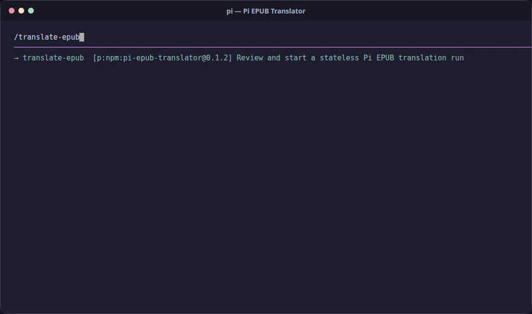

# Pi EPUB Translator

[](https://www.npmjs.com/package/pi-epub-translator)
[](https://github.com/ltdthanhdat/pi-epub-translator/actions/workflows/publish-npm.yml)
[](LICENSE)

A Pi extension for translating selected EPUB content while preserving the book's XML structure and EPUB package.

## See it in action



The demo uses the normal package installation flow and a real sample EPUB. Translation progress is shortened in the recording.

## Highlights

- **Review first** — edit the AI-proposed document scope and glossary before translating.
- **Preserve structure** — translated fragments must keep their tags and attributes; package members are checked before output.
- **Parallel workers** — isolated, no-session Pi workers claim fragments through SQLite leases and fencing.
- **Manage runs** — inspect progress, request cancellation, and retry eligible failed fragments.

## Install

```bash
pi install npm:pi-epub-translator
```

## Use

1. Put a non-DRM EPUB in `input/`.
2. Start Pi normally with `pi`.
3. Run `/translate-epub`.
4. Choose the EPUB, model, thinking level, target language, and worker count.
5. Review the document scope and glossary, then confirm.
6. Find the translated EPUB in `output/` after the run completes.

The source EPUB is not modified. Run state is stored in `.parallel-translate/`.

## Commands

| Command | Description |
| --- | --- |
| `/translate-epub` | Start the guided translation workflow. |
| `/epub-progress` | Show progress for the current or most recent run. |
| `/epub-cancel` | Request cancellation at the next worker checkpoint. |
| `/epub-retry` | Reset eligible failed fragments and start replacement workers. |

## Requirements

- [Pi CLI](https://github.com/badlogic/pi-mono)
- Node.js and npm
- Python 3.10+
- A local EPUB without DRM
- At least one model configured in Pi

Selected EPUB content is sent to the configured Pi model. Check your provider's data-handling policy before translating private books.

## Files

| Path | Purpose |
| --- | --- |
| `input/` | Source EPUBs; ignored by Git |
| `output/` | Translated EPUBs; ignored by Git |
| `.parallel-translate/` | SQLite run state; ignored by Git |

Do not commit books, translated output, credentials, or run state.

## Development

```bash
npm ci
npm test
python3 tests/test_run_store.py
npm pack --dry-run
```

For local source testing only:

```bash
pi --approve -e ./src/index.ts
```

## Release

Publishing is automated by [`.github/workflows/publish-npm.yml`](.github/workflows/publish-npm.yml) when a `v*` tag is pushed:

```bash
npm version patch
git push --follow-tags
```

The workflow checks the tag/version match, runs both test suites, and publishes the package with npm provenance.

[Repository](https://github.com/ltdthanhdat/pi-epub-translator) · [Issues](https://github.com/ltdthanhdat/pi-epub-translator/issues) · [MIT License](LICENSE)
